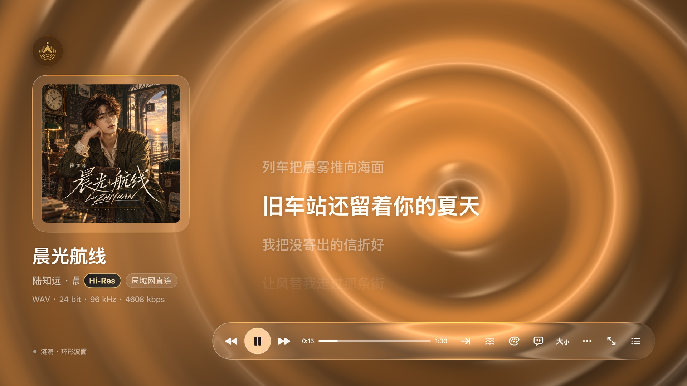
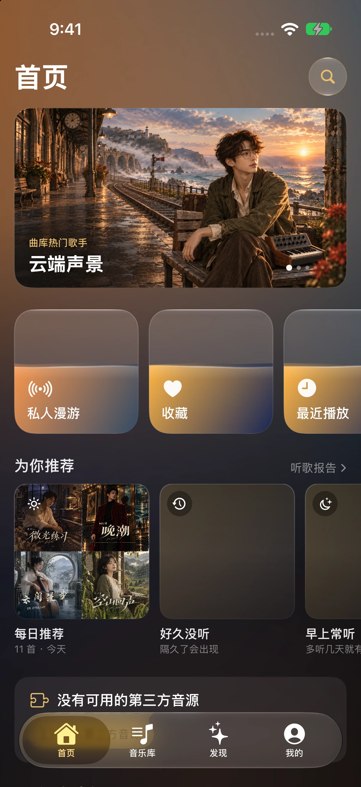
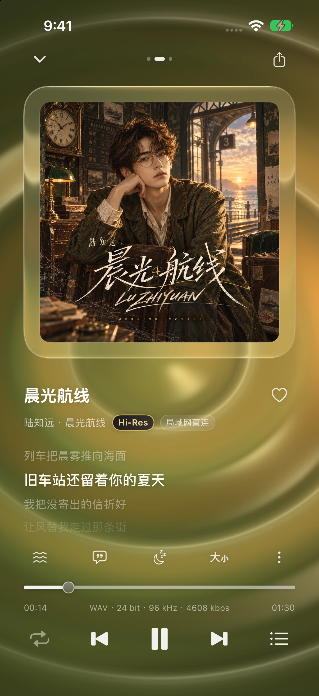

# 音屿 SongLib Amp

**你的音乐 自成一屿**

Apple TV 与 iPhone 私人音乐播放器，连接自己的 NAS 曲库，原格式播放，显示同步歌词。

本仓库用于发布安装包、更新说明和收集反馈，不包含应用源码。

[官网](https://songlib.playsong.cn/) · [安装说明](https://songlib.playsong.cn/install.html) · [最新安装包](https://github.com/songdone/SongLibAmp-Release/releases/latest) · [问题反馈](https://github.com/songdone/SongLibAmp-Release/issues)

## 下载与系统要求

| 平台 | 当前版本 | 系统要求 | 下载 |
| --- | --- | --- | --- |
| Apple TV | 1.8.34 | tvOS 18 及以上 | [SongLibAmp-tvOS-1.8.34.ipa](https://github.com/songdone/SongLibAmp-Release/releases/download/tvOS-1.8.34-iOS-0.4.7/SongLibAmp-tvOS-1.8.34.ipa) |
| iPhone | 0.4.7 | iOS 16.4 及以上 | [SongLibAmp-iOS-0.4.7.ipa](https://github.com/songdone/SongLibAmp-Release/releases/download/tvOS-1.8.34-iOS-0.4.7/SongLibAmp-iOS-0.4.7.ipa) |

两端均为**未签名 IPA**，需要自行签名后安装。按官网教程操作，需要 Mac、Xcode 和自己的 Apple ID；免费 Apple ID 的签名到期后需要重新签名并覆盖安装。

项目仍在持续开发，功能尚不完善，可能遇到 bug。TV 端目前仅在最新一代 Apple TV 上测试，其他型号尚未验证。建议先阅读安装说明，再下载和试用。

安装包统一通过本仓库的 GitHub Releases 下载。

## 界面展示






截图来自应用的示例曲库，使用原创专辑封面、虚构音乐人写真、合成音频和原创演示歌词。TV 和 iPhone 的播放、歌词截图采用涟漪背景；频谱背景为 Pro 功能。更多页面可在官网轮播中查看。

## 功能

- **媒体库连接**：Plex、Emby、飞牛音乐、极音乐、Navidrome / Subsonic、WebDAV。
- **歌词与播放**：原格式播放、同步歌词、全屏歌词、歌词时间校准、待播队列；手机端支持横屏播放和睡眠定时。
- **本机音乐**：缓存曲目、本地歌单、存储与下载管理；手机可从「文件」导入音乐。
- **推荐与报告**：每日推荐、好久没听、时段常听和听歌报告。
- **Pro 功能**：多库合并、频谱背景、在线发现、曲库管家。

## 授权与音乐内容

新安装有 3 天基础功能试用，官网可领取 60 天 Pro 内测码。一个付费授权码可分别激活一台 Apple TV 和一台 iOS 设备。

音屿不提供音乐内容，也不内置第三方音源。在线发现与在线播放需自行导入兼容且可用的模块或音源。

## 文件校验

每次发布附带 `SHA256SUMS.txt`。在 Mac 的终端中，进入安装包和校验文件所在目录后执行：

```sh
shasum -a 256 -c SHA256SUMS.txt
```

## 反馈

请在 Issues 中说明设备型号、系统版本、应用版本、媒体库类型、操作步骤和实际表现。截图请遮挡服务器地址、账号和授权码，不要公开密码或令牌。
